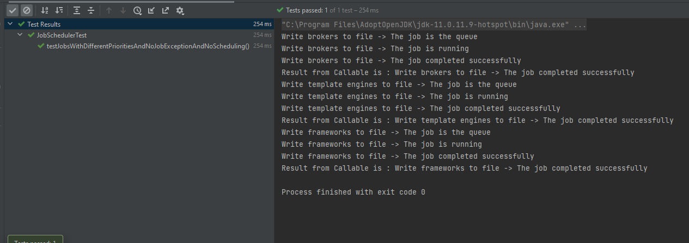
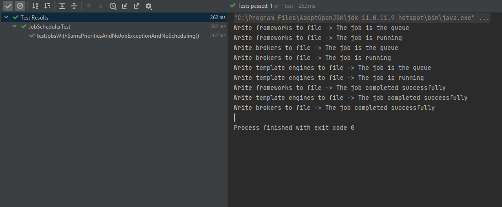
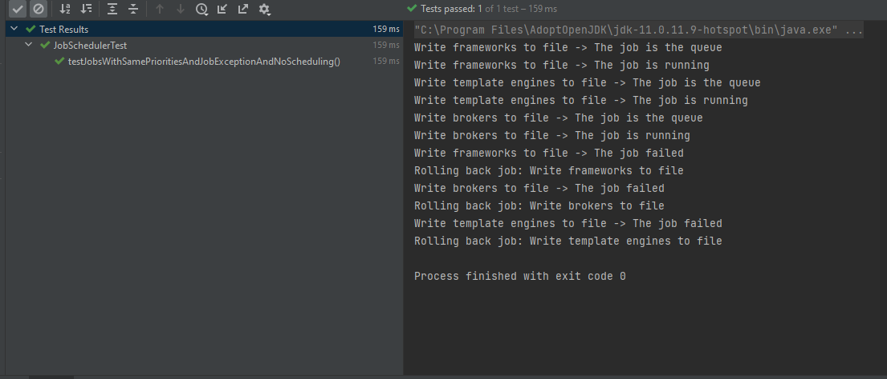
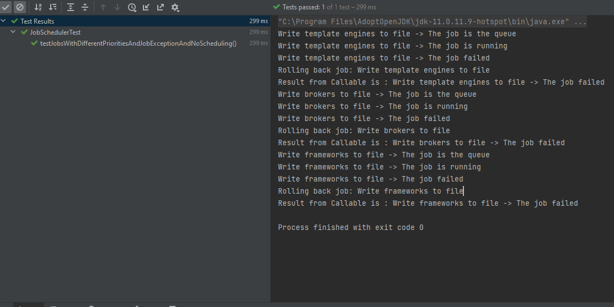
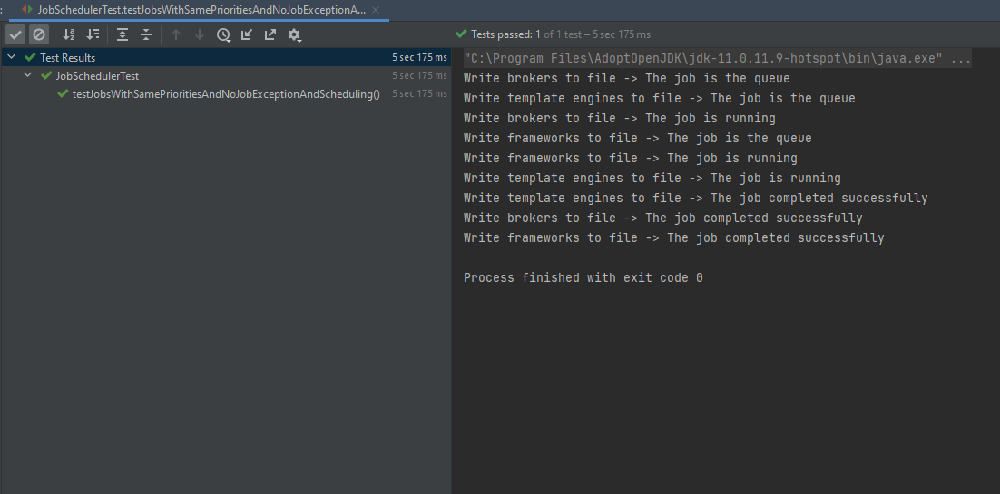
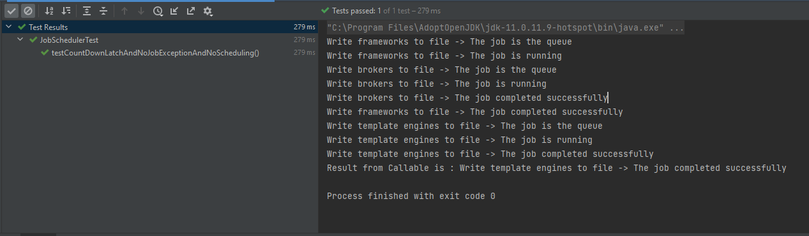

# A Simple Job Scheduler

This job scheduler was built using Java 11 concurrency and collections.
I will describe how I chose to implement each feature requested by the system.

## Flexibility
The scheduler has almost no knowledge about the details of the job execution. To add a job to the scheduler we use the following method from the Scheduler class:

    public <T extends Job> void submit(T job)

This method accepts any job that extends the Job class. The Job class is an abstract class with many methods and two of them are abstract:

    abstract void execute() throws JobException;
    abstract void rollback();

Every subclass must provide implementations for these two methods. The execute() method is used by the job scheduler to start the execution of the job. The rollback() method is used by the scheduler in case the job fails. For example, let's say we have a job that creates a file and writes data to that file. In case anything bad happens during writing, then the execute() method must throw a JobException. This type of exception will be caught by the scheduler, then it will figure out that that job failed and will call the rollback() method. In this case, the rollback() method deletes the file.

Over time we will not have to change the scheduler's logic. The only existent constraint is that any subclass that extends the Job class must abide by the rules of the contract (i.e. provide valid implementations for the two abstract methods and throw a JobException in the execute() method in case anything bad happens during execution).

# Reliability
A job either completes successfully or fails. In case of failure the scheduler calls the rollback() method (please see the example with the file in the previous section). For more details, see the performJob(Job job) method from the Scheduler class. The performJob(Job job) method is also described in the next section.

# Internal consistency
Each job has a private instance field called state of type State. State is an enum with four values: QUEUED, RUNNING, SUCCESS and FAILED. I also provided a corresponding message for each value (for debugging purposes).

When the job is added to the queue, the scheduler sets the job's state to QUEUED in the submit(T job) method. Afterwards, the performJob(Job job) method starts to execute the Job. The steps of the execution are listed below:
1. The scheduler sets the jobs's state to RUNNING and calls the execute() method on the job instance.
2. If everything goes well with the execution, then the scheduler considers that the job completed successfully and sets the jobs' state to SUCCESS. Then, the scheduler returns a string consisting of the job description and the corresponding message of the SUCCESS enum value. This string might be used by the Future\<String> object in the startScheduler() method (I'll talk more about this method later).
3. If something bad happens in the execute() method and it throws a JobException, then we enter the catch clause. Here, the scheduler sets the job's state to FAILED and calls on the rollback() method on the job instance. The rollback is performed and then the scheduler returns a string consisting of the job description and the corresponding message of the FAILED enum value.

# Priority and Scheduling
The jobs are put in a PriorityQueue<Job>. The Job class implements the Comparable interface and overrides the compareTo(Object o) method. The implementation is shown below:

    @Override
    public final int compareTo(Job job) {
        return Integer.compare(job.getPriority(), this.getPriority());
    }

I chose to make the method final so the order will be the same for all jobs. The job class has a private instance field called priority of type int. The compareTo(Object o) method keeps the elements in the queue in the descending order of the priority. For example, if we insert three jobs with the priorities in this order: (2, 3, 1) then the elements will have the following order in the queue: (3, 2, 1). The job with the highest priority (i.e 3) will be executed first.

Note: I also use concurrency in this application. I chose not to use a PriorityBlockingQueue because only the main thread performs operations on the queue and no other threads read or modify it.

Regarding the scheduling of jobs, the scheduler can perform jobs whose execution start after a certain amount of time after the scheduler had started. For example, we start the scheduler and we can have a job that should be executed after 20 seconds. To accomplish this, I use a ScheduledExecutorService with the number of threads equal to the number of jobs.

### The Job Execution Algorithm

We know that the job with the highest priority is the first in the queue. We try to find if there are other jobs with the same priority. For example, if the highest priority is 5, then we search for other jobs with the priority 5. Of course, the compareTo(Object o) method implementation from the Job class makes sure that they are one after the another in the queue like this: (5, 5, 3, 1). If there is only one job with the priority 5, then we execute it. We use the ScheduledExecutorService to schedule a Callable and call the performJob(Job job) method. Afterwards, we get a Future<String> object and we call the get() method which blocks the main thread (which is what we want, i.e. to execute only this specific job and no others).

If there are multiple jobs with the same priority then we execute them concurrently. Let's use the previous example: (5, 5, 3, 1). Firstly, we find the number of jobs with the same priority which is 2. Then, we call the schedule(..) method from the ScheduledExecutorService twice (i.e. for each of the 2 jobs). Meanwhile, we make sure that no other jobs start until the two jobs finish. To accomplish this, I chose to use a CountDownLatch object. The value passed to the CountDownLatch constructor is the number of jobs with the same priority because that means we will have two threads. The declaration is shown below:

    CountDownLatch latch = new CountDownLatch((int)atomicCounter.get())

We call the await() method on the latch object to make sure that the main thread waits until the two threads finish. Each thread calls the countDown() method on the latch object. When the count reaches zero, the main thread resumes.

Note: So far, I used the schedule(...) method from the ScheduledExecutorService to submit the Callables and I assumed that the jobs started immediately (no delay).  I will talk about scheduling next.

When I implemented scheduling I made the following assumptions:
1. Jobs that have the same priority and the same delays (i.e. 20 seconds each) will be executed concurrently.
2. A job with a lower priority must have the delay bigger that a job with a higher priority. For example, if job 1 has priority 5 and a delay of 20 seconds, then job 2 with the priority of 4 must have a bigger delay, like 35. Also, job 2 does not get executed immediately after job 1 ends.
3. Jobs that have the same highest priority and different delays will be executed also concurrently, but with a certain delay between them. Here I am trying to say that even if there is a delay, no other job with a lower priority and a lower delay (or none) get executed. Of course, we must take into consideration the second assumption that says: a job with a lower priority must have the delay bigger that a job with a higher priority. So the situation described here should not occur, but I wanted to point it out.

# Tests
1. We submit 3 jobs with different priorities: (1, 4 and 3). The jobs are executed one after another.

   

2. We submit 3 jobs with same priorities: (3, 3 and 3). The jobs are executed concurrently.

   

3. We submit 3 jobs with same priorities: (3, 3 and 3) and all three throw JobException. We can see the jobs were rolled back by the scheduler. 

   

4. We submit 3 jobs with different priorities: (2, 4 and 5) and all three throw JobException. We can see the jobs were rolled back by the scheduler. 

   

5. We submit 3 jobs with same priorities: (3, 3 and 3) and we schedule them to start after 5 seconds. 

5. We submit 3 jobs with the following priorities: (4, 4 and 2). As we can see in the image, the 2 jobs with priority 4 are executed first. Afterwards, the job with the priority 2 are executed. We can see that the CountDownLatch works.
   
   
## Notes
* Regarding tests 2, 3 and 5: for each each test the jobs are run concurrently because all 3 jobs have the same priority. Due to the non-deterministic behaviour of threads, we might get different outputs if we run the tests again.
* Regarding test 1 and 5: for each test the jobs are run one after another. The order must be the same if we run the tests again.
* The tests can be found in the JobSchedulerTest class.
   
# Improvements
1. If we have a job with priority 5 that is scheduled to start tomorrow and we have a job with priority 3 that must start in 5 seconds, then we should execute the job with the priority 3. The current implementation does not allow this. The scheduler waits to start the job with the highest priority. The scheduler should be modified in order to handle cases like this with very different priorities and schedules.
2. Provide a REST API to query the scheduler and see all the running jobs and the ones that are in the queue. We should be able to submit new jobs using POST requests, we should be able to remove certain jobs from the queue or stop a running job.

   
